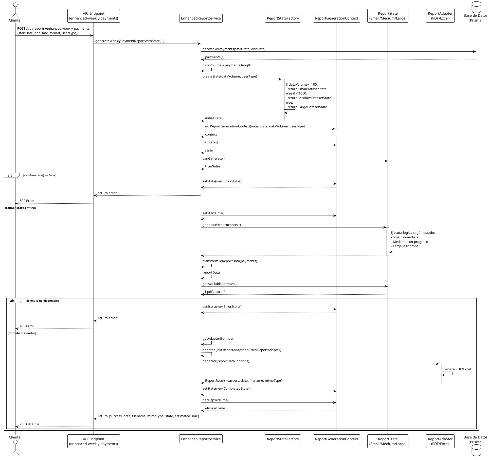

# Patrones State y Adapter: Implementación Conjunta

## Resumen

Este documento explica cómo los patrones **State** y **Adapter** trabajan juntos en el sistema de generación de reportes para resolver problemas complejos de manera elegante.

## Análisis Comparativo: Ejemplo Básico vs Implementación

### Comparación con el Ejemplo Básico del Patrón State

Para evaluar si el patrón State se aplicó correctamente, compararemos la implementación con el ejemplo básico estándar:

#### Ejemplo Básico (Referencia)
```typescript
// Context mantiene referencia al estado
class Context {
    private state: State;
    public transitionTo(state: State): void { ... }
    public request1(): void { this.state.handle1(); }
    public request2(): void { this.state.handle2(); }
}

// State abstracto con referencia al contexto
abstract class State {
    protected context: Context;
    public setContext(context: Context) { ... }
    public abstract handle1(): void;
    public abstract handle2(): void;
}

// Estados concretos pueden cambiar el contexto
class ConcreteStateA extends State {
    public handle1(): void {
        this.context.transitionTo(new ConcreteStateB());
    }
}
```

#### Implementación en la Aplicación
```typescript
// Context mantiene referencia al estado
class ReportGenerationContext {
    private state: ReportState;
    public setState(state: ReportState): void { ... }
    public getState(): ReportState { ... }
}

// State como interfaz (sin referencia al contexto)
interface ReportState {
    canGenerate(): boolean;
    generateReport(context: ReportGenerationContext): Promise<void>;
    getAvailableFormats(): string[];
    // ...
}

// Estados concretos reciben contexto como parámetro
class SmallDatasetState implements ReportState {
    async generateReport(context: ReportGenerationContext): Promise<void> {
        // No cambia el estado directamente
    }
}
```

### ✅ Aspectos Correctamente Implementados

1. **Context mantiene referencia al estado**: ✅
   - `ReportGenerationContext` tiene `private state: ReportState`
   - Similar al ejemplo básico

2. **Context puede cambiar de estado**: ✅
   - `setState()` permite cambiar el estado
   - Similar a `transitionTo()` del ejemplo básico

3. **Estados concretos implementan la interfaz**: ✅
   - `SmallDatasetState`, `MediumDatasetState`, etc. implementan `ReportState`
   - Similar a `ConcreteStateA`, `ConcreteStateB` que extienden `State`

4. **Comportamiento varía según el estado**: ✅
   - Cada estado tiene su propia lógica en `generateReport()`
   - Similar a `handle1()` y `handle2()` en el ejemplo básico

5. **Delegación del comportamiento al estado**: ✅
   - El servicio llama a `state.generateReport(context)`
   - Similar a `context.request1()` que llama a `state.handle1()`

### ⚠️ Diferencias con el Ejemplo Básico (Variaciones Válidas)

1. **Los estados NO tienen referencia al contexto**:
   - **Ejemplo básico**: `protected context: Context` en la clase base
   - **Tu implementación**: El contexto se pasa como parámetro
   - **¿Es correcto?**: ✅ **SÍ**, es una variación válida y más flexible
   - **Ventaja**: Los estados no están acoplados al contexto, pueden reutilizarse

2. **Los estados NO cambian el contexto directamente**:
   - **Ejemplo básico**: `this.context.transitionTo(new ConcreteStateB())`
   - **Tu implementación**: El servicio cambia el estado del contexto
   - **¿Es correcto?**: ✅ **SÍ**, es una variación válida
   - **Ventaja**: Control centralizado de transiciones, más fácil de debuggear

3. **Uso de Factory Pattern**:
   - **Ejemplo básico**: No tiene factory
   - **Tu implementación**: `ReportStateFactory` crea estados
   - **¿Es correcto?**: ✅ **SÍ**, es una mejora al patrón básico
   - **Ventaja**: Lógica de creación centralizada, más mantenible

4. **Context no delega directamente**:
   - **Ejemplo básico**: `context.request1()` → `state.handle1()`
   - **Tu implementación**: El servicio llama directamente a `state.generateReport()`
   - **¿Es correcto?**: ✅ **SÍ**, es una variación válida
   - **Ventaja**: El servicio puede agregar lógica adicional antes/después

### 📊 Evaluación Final

| Aspecto | Ejemplo Básico | Tu Implementación | Estado |
|---------|---------------|-------------------|--------|
| Context mantiene estado | ✅ | ✅ | ✅ Correcto |
| Context puede cambiar estado | ✅ | ✅ | ✅ Correcto |
| Estados concretos implementan interfaz | ✅ | ✅ | ✅ Correcto |
| Comportamiento varía por estado | ✅ | ✅ | ✅ Correcto |
| Delegación al estado | ✅ | ✅ | ✅ Correcto |
| Estados tienen referencia al contexto | ✅ | ❌ (parámetro) | ⚠️ Variación válida |
| Estados cambian el contexto | ✅ | ❌ (servicio lo hace) | ⚠️ Variación válida |
| Factory para crear estados | ❌ | ✅ | ✅ Mejora |

### 🎯 Conclusión

**✅ SÍ, el patrón State se aplicó correctamente**, aunque con variaciones válidas que mejoran la implementación:

1. **Cumple con los principios fundamentales del patrón**:
   - Separación de comportamiento por estado
   - Context mantiene y cambia de estado
   - Estados encapsulan comportamiento específico

2. **Mejoras sobre el ejemplo básico**:
   - Desacoplamiento: estados no dependen del contexto
   - Control centralizado: servicio maneja transiciones
   - Factory Pattern: creación de estados más limpia
   - Integración con Adapter: uso práctico del patrón

3. **Funciona correctamente en la aplicación**:
   - Estados determinan formatos disponibles
   - Estados controlan tiempo estimado
   - Estados validan capacidad de generación
   - Transiciones de estado funcionan correctamente

### 🔄 Cómo Funciona el Patrón State en la Aplicación

#### Flujo de Ejecución Paso a Paso

1. **Inicialización del Estado**:
```typescript
// En EnhancedReportService.generateWeeklyPaymentReportWithState()
const payments = await this.getWeeklyPayments(prisma, startDate, endDate)
const dataVolume = payments.length  // Ejemplo: 150 registros

// Factory crea el estado apropiado
const initialState = ReportStateFactory.createState(dataVolume, userType)
// → Retorna: new MediumDatasetState() (porque 150 < 1000)

// Se crea el contexto con el estado inicial
this.currentContext = new ReportGenerationContext(initialState, dataVolume, userType)
```

2. **Verificación de Capacidad**:
```typescript
// El servicio consulta al estado si puede generar
if (!this.currentContext.getState().canGenerate()) {
    // Si retorna false, cambia a ErrorState
    this.currentContext.setState(new ErrorState('...'))
}
// En este caso, MediumDatasetState.canGenerate() retorna true ✅
```

3. **Ejecución según el Estado**:
```typescript
// El servicio delega la ejecución al estado
await this.currentContext.getState().generateReport(this.currentContext)

// MediumDatasetState.generateReport() ejecuta:
// - console.log('📊 Generando reporte para dataset mediano con progreso...')
// - Lógica específica para datasets medianos
```

4. **Consulta de Formatos Disponibles**:
```typescript
// El estado determina qué formatos están disponibles
const availableFormats = this.currentContext.getState().getAvailableFormats()
// MediumDatasetState retorna: ['pdf', 'excel']

// El servicio verifica si el formato solicitado está disponible
if (!availableFormats.includes(options.format)) {
    // Si no está disponible, cambia a ErrorState
    this.currentContext.setState(new ErrorState('...'))
}
```

5. **Transición de Estado**:
```typescript
// Después de generar exitosamente, cambia a CompletedState
this.currentContext.setState(new CompletedState())

// O en caso de error:
this.currentContext.setState(new ErrorState('Error message'))
```

#### Ejemplo de Ejecución Real

**Escenario**: Usuario solicita reporte con 250 registros en formato PDF

```typescript
// 1. Factory crea estado
const state = ReportStateFactory.createState(250, 'basic_user')
// → new MediumDatasetState()

// 2. Context se crea con el estado
const context = new ReportGenerationContext(state, 250, 'basic_user')
// Estado actual: MediumDatasetState

// 3. Verificación
state.canGenerate()  // → true ✅

// 4. Ejecución
await state.generateReport(context)
// → Ejecuta lógica de MediumDatasetState

// 5. Consulta formatos
state.getAvailableFormats()  // → ['pdf', 'excel'] ✅
// PDF está disponible, continúa

// 6. Generación con adaptador
const adapter = getAdapter('pdf')  // → PDFReportAdapter
await adapter.generate(reportData, options)

// 7. Transición final
context.setState(new CompletedState())
// Estado actual: CompletedState
```

#### Ventajas de esta Implementación

1. **Desacoplamiento**: Los estados no conocen el contexto, solo reciben parámetros
   ```typescript
   // ✅ Buena práctica: Estado recibe contexto como parámetro
   async generateReport(context: ReportGenerationContext): Promise<void>
   
   // ❌ Acoplamiento: Estado mantiene referencia al contexto
   // protected context: Context  // No usado en tu implementación
   ```

2. **Control Centralizado**: El servicio controla todas las transiciones
   ```typescript
   // ✅ Transiciones controladas por el servicio
   if (!canGenerate) {
       context.setState(new ErrorState('...'))
   }
   
   // ✅ Más fácil de debuggear y mantener
   ```

3. **Extensibilidad**: Fácil agregar nuevos estados
   ```typescript
   // Solo necesitas:
   // 1. Crear nueva clase que implemente ReportState
   // 2. Agregar lógica en ReportStateFactory
   // 3. El resto del código no cambia
   ```

4. **Testabilidad**: Estados son fáciles de testear independientemente
   ```typescript
   // Puedes testear cada estado por separado
   const state = new SmallDatasetState()
   expect(state.canGenerate()).toBe(true)
   expect(state.getAvailableFormats()).toEqual(['pdf', 'excel'])
   ```

## Aplicación del Patrón State

### Estructura del Patrón State

El patrón State se aplica para manejar diferentes comportamientos de generación de reportes según el **volumen de datos** y el **tipo de usuario**. La implementación sigue la estructura clásica del patrón:

#### 1. **Interfaz State (`ReportState`)**
Define el contrato que todos los estados deben cumplir:
- `canGenerate()`: Verifica si se puede generar el reporte
- `generateReport()`: Ejecuta la generación según el estado
- `getAvailableFormats()`: Retorna los formatos disponibles según el estado
- `getEstimatedTime()`: Retorna el tiempo estimado de generación
- `getStateName()`: Retorna el nombre del estado actual

#### 2. **Estados Concretos**
- **`SmallDatasetState`**: Para datasets < 100 registros
  - Generación inmediata (2 segundos)
  - Todos los formatos disponibles (PDF, Excel)
  
- **`MediumDatasetState`**: Para datasets 100-1000 registros
  - Generación con progreso (5 segundos)
  - Todos los formatos disponibles
  
- **`LargeDatasetState`**: Para datasets > 1000 registros
  - Generación asíncrona (15 segundos)
  - Todos los formatos disponibles (podría limitarse)
  
- **`ErrorState`**: Estado de error
  - No permite generación
  - Sin formatos disponibles
  
- **`CompletedState`**: Estado final
  - Indica que la generación terminó
  - No permite nueva generación

#### 3. **Context (`ReportGenerationContext`)**
Mantiene una referencia al estado actual y proporciona métodos para:
- Cambiar de estado (`setState()`)
- Obtener el estado actual (`getState()`)
- Almacenar información del contexto (volumen de datos, tipo de usuario)
- Medir tiempo de ejecución

#### 4. **Factory (`ReportStateFactory`)**
Crea el estado apropiado basándose en:
- Volumen de datos (número de registros)
- Tipo de usuario (aunque actualmente no se usa en la lógica de selección)

### Flujo de Funcionalidad con Adapter

El flujo completo de generación de reportes combina ambos patrones de la siguiente manera:

```
┌─────────────────────────────────────────────────────────────────┐
│ 1. API Endpoint (enhanced-weekly-payments.ts)                   │
│    - Recibe solicitud con: startDate, endDate, format, userType │
└────────────────────────────┬────────────────────────────────────┘
                             │
                             ▼
┌─────────────────────────────────────────────────────────────────┐
│ 2. EnhancedReportService                                        │
│    - Obtiene datos de la base de datos                          │
│    - Calcula volumen de datos (dataVolume)                     │
└────────────────────────────┬────────────────────────────────────┘
                             │
                             ▼
┌─────────────────────────────────────────────────────────────────┐
│ 3. ReportStateFactory.createState(dataVolume, userType)         │
│    - Crea estado inicial según volumen:                          │
│      • dataVolume < 100   → SmallDatasetState                   │
│      • dataVolume < 1000  → MediumDatasetState                  │
│      • dataVolume >= 1000 → LargeDatasetState                   │
└────────────────────────────┬────────────────────────────────────┘
                             │
                             ▼
┌─────────────────────────────────────────────────────────────────┐
│ 4. ReportGenerationContext                                      │
│    - Almacena estado inicial                                     │
│    - Almacena dataVolume y userType                             │
│    - Inicia medición de tiempo                                   │
└────────────────────────────┬────────────────────────────────────┘
                             │
                             ▼
┌─────────────────────────────────────────────────────────────────┐
│ 5. Verificación de Capacidad                                    │
│    - state.canGenerate() → true/false                           │
│    - Si false → cambia a ErrorState                             │
└────────────────────────────┬────────────────────────────────────┘
                             │
                             ▼
┌─────────────────────────────────────────────────────────────────┐
│ 6. Ejecución de Generación según Estado                         │
│    - state.generateReport(context)                               │
│    - Cada estado tiene su propia lógica:                        │
│      • Small: Generación inmediata                              │
│      • Medium: Generación con progreso                          │
│      • Large: Generación asíncrona                              │
└────────────────────────────┬────────────────────────────────────┘
                             │
                             ▼
┌─────────────────────────────────────────────────────────────────┐
│ 7. Transformación de Datos                                      │
│    - transformToReportData()                                    │
│    - Convierte datos de BD a ReportData                         │
└────────────────────────────┬────────────────────────────────────┘
                             │
                             ▼
┌─────────────────────────────────────────────────────────────────┐
│ 8. Verificación de Formato Disponible                           │
│    - state.getAvailableFormats()                                │
│    - Verifica si el formato solicitado está disponible          │
│    - Si no → cambia a ErrorState                                │
└────────────────────────────┬────────────────────────────────────┘
                             │
                             ▼
┌─────────────────────────────────────────────────────────────────┐
│ 9. Selección de Adaptador (Patrón Adapter)                      │
│    - getAdapter(format)                                         │
│    - Obtiene adaptador del Map:                                 │
│      • 'pdf' → PDFReportAdapter                                 │
│      • 'excel'/'xlsx' → ExcelReportAdapter                     │
└────────────────────────────┬────────────────────────────────────┘
                             │
                             ▼
┌─────────────────────────────────────────────────────────────────┐
│ 10. Generación del Reporte (Adapter)                            │
│     - adapter.generate(reportData, options)                      │
│     - PDFReportAdapter: Genera PDF con jsPDF                    │
│     - ExcelReportAdapter: Genera Excel con XLSX                │
└────────────────────────────┬────────────────────────────────────┘
                             │
                             ▼
┌─────────────────────────────────────────────────────────────────┐
│ 11. Cambio de Estado Final                                      │
│     - context.setState(new CompletedState())                    │
│     - Calcula tiempo transcurrido                               │
└────────────────────────────┬────────────────────────────────────┘
                             │
                             ▼
┌─────────────────────────────────────────────────────────────────┐
│ 12. Respuesta al Cliente                                        │
│     - Retorna: success, data, filename, mimeType                │
│     - Incluye: state, estimatedTime                             │
└─────────────────────────────────────────────────────────────────┘
```

### Integración State + Adapter

La integración se logra de la siguiente manera:

1. **El Estado Controla los Adaptadores Disponibles**:
   ```typescript
   // El estado determina qué formatos están disponibles
   const availableFormats = context.getState().getAvailableFormats()
   if (!availableFormats.includes(options.format)) {
     // Error: formato no disponible en este estado
   }
   ```

2. **El Servicio Selecciona el Adaptador Apropiado**:
   ```typescript
   // El servicio obtiene el adaptador según el formato solicitado
   const adapter = this.getAdapter(options.format)
   const result = await adapter.generate(reportData, options)
   ```

3. **El Estado Puede Cambiar Durante el Proceso**:
   - Estado inicial: `SmallDatasetState` / `MediumDatasetState` / `LargeDatasetState`
   - Si hay error: `ErrorState`
   - Al completar: `CompletedState`

4. **Los Adaptadores Son Independientes del Estado**:
   - Los adaptadores no conocen el estado
   - Solo reciben `ReportData` y `ReportOptions`
   - El estado solo controla la disponibilidad, no la implementación

## Problemas Resueltos Individualmente

### Patrón Adapter (Ya Implementado)
- **Problema**: Convertir datos JSON a diferentes formatos (PDF, Excel)
- **Solución**: `PDFReportAdapter` y `ExcelReportAdapter` implementan `ReportAdapter`
- **Beneficio**: Flexibilidad para agregar nuevos formatos sin modificar código existente

### Patrón State (Nueva Implementación)
- **Problema**: Manejar diferentes comportamientos según el estado del sistema
- **Solución**: Estados que cambian el comportamiento de generación de reportes
- **Beneficio**: Control inteligente del flujo según condiciones dinámicas

## Problemas que Resuelven Juntos

### 1. **Adaptación Inteligente según Volumen de Datos**

```typescript
// El patrón State determina qué adaptadores están disponibles
class SmallDatasetState {
  getAvailableFormats(): string[] {
    return ['pdf', 'excel'] // Todos los formatos disponibles
  }
}

class LargeDatasetState {
  getAvailableFormats(): string[] {
    return ['pdf'] // Solo PDF para datasets grandes (más eficiente)
  }
}
```

### 2. **Comportamiento Diferenciado por Tipo de Usuario**

```typescript
// Estados que limitan funcionalidades según el usuario
class BasicUserState {
  getAvailableFormats(): string[] {
    return ['pdf'] // Solo PDF básico
  }
}

class PremiumUserState {
  getAvailableFormats(): string[] {
    return ['pdf', 'excel'] // PDF + Excel con estadísticas
  }
}
```

### 3. **Manejo de Errores Contextual**

```typescript
// El estado puede cambiar a ErrorState y el adaptador maneja el error apropiadamente
class ErrorState {
  async generateReport(context: ReportGenerationContext): Promise<void> {
    // El adaptador recibe el estado de error y puede generar un reporte de error
    throw new Error(`No se puede generar reporte: ${this.error}`)
  }
}
```

## Flujo de Trabajo Combinado

```
1. Cliente solicita reporte
   ↓
2. Sistema determina volumen de datos
   ↓
3. Patrón State crea estado apropiado (Small/Medium/Large)
   ↓
4. Estado determina qué adaptadores están disponibles
   ↓
5. Patrón Adapter convierte datos al formato solicitado
   ↓
6. Estado cambia a "Completed" o "Error"
   ↓
7. Respuesta incluye información del estado y resultado
```

## Ventajas de la Combinación

### 1. **Flexibilidad Extrema**
- Nuevos formatos: Solo agregar nuevo adaptador
- Nuevos estados: Solo agregar nueva clase de estado
- Nuevos comportamientos: Combinar estados y adaptadores

### 2. **Mantenibilidad**
- Separación clara de responsabilidades
- Fácil testing de cada componente por separado
- Código más legible y organizado

### 3. **Escalabilidad**
- Fácil agregar nuevos tipos de usuarios
- Fácil agregar nuevos formatos de reporte
- Fácil agregar nuevos criterios de estado

### 4. **Robustez**
- Manejo inteligente de errores
- Adaptación automática según condiciones
- Prevención de problemas antes de que ocurran

## Casos de Uso Prácticos

### Caso 1: Usuario Básico con Dataset Grande
```
Estado: LargeDatasetState
Adaptadores disponibles: ['pdf']
Resultado: Solo PDF, generación asíncrona
```

### Caso 2: Usuario Premium con Dataset Pequeño
```
Estado: SmallDatasetState  
Adaptadores disponibles: ['pdf', 'excel']
Resultado: Ambos formatos, generación inmediata
```

### Caso 3: Error en la Generación
```
Estado: ErrorState
Adaptadores disponibles: []
Resultado: Error manejado apropiadamente
```

## Implementación en el Código

### Archivos Creados:
1. `src/application/states/ReportGenerationState.ts` - Implementación del patrón State
2. `src/application/services/EnhancedReportService.ts` - Servicio que combina ambos patrones
3. `pages/api/reports/enhanced-weekly-payments.ts` - API endpoint que usa la implementación combinada

### Archivos Existentes (Sin Modificar):
1. `src/infrastructure/adapters/PDFReportAdapter.ts` - Adaptador PDF
2. `src/infrastructure/adapters/ExcelReportAdapter.ts` - Adaptador Excel
3. `src/shared/types/Report.ts` - Interfaces base

## Conclusión

La combinación de los patrones **State** y **Adapter** crea un sistema robusto y flexible que:

- **Adapta** el comportamiento según el contexto (volumen de datos, tipo de usuario)
- **Convierte** datos a diferentes formatos de manera consistente
- **Maneja** errores de forma inteligente
- **Escala** fácilmente para futuras necesidades

Esta implementación demuestra cómo los patrones de diseño pueden trabajar juntos para crear soluciones más elegantes y mantenibles.

## Diagrama UML - Integración State + Adapter

El siguiente diagrama UML muestra la estructura completa de clases y sus relaciones. Puedes copiarlo y pegarlo en [PlantUML Online](http://www.plantuml.com/plantuml/uml/) para visualizarlo.

```plantuml
@startuml
!theme plain
skinparam classAttributeIconSize 0

' ============================================
' PATRÓN STATE
' ============================================

interface ReportState {
  +canGenerate(): boolean
  +generateReport(context: ReportGenerationContext): Promise<void>
  +getAvailableFormats(): string[]
  +getEstimatedTime(): number
  +getStateName(): string
}

class SmallDatasetState {
  +canGenerate(): boolean
  +generateReport(context): Promise<void>
  +getAvailableFormats(): string[]
  +getEstimatedTime(): number
  +getStateName(): string
}

class MediumDatasetState {
  +canGenerate(): boolean
  +generateReport(context): Promise<void>
  +getAvailableFormats(): string[]
  +getEstimatedTime(): number
  +getStateName(): string
}

class LargeDatasetState {
  +canGenerate(): boolean
  +generateReport(context): Promise<void>
  +getAvailableFormats(): string[]
  +getEstimatedTime(): number
  +getStateName(): string
}

class ErrorState {
  -error: string
  +canGenerate(): boolean
  +generateReport(context): Promise<void>
  +getAvailableFormats(): string[]
  +getEstimatedTime(): number
  +getStateName(): string
  +getError(): string
}

class CompletedState {
  +canGenerate(): boolean
  +generateReport(context): Promise<void>
  +getAvailableFormats(): string[]
  +getEstimatedTime(): number
  +getStateName(): string
}

class ReportGenerationContext {
  -state: ReportState
  -dataVolume: number
  -userType: string
  -startTime: Date | null
  +setState(state: ReportState): void
  +getState(): ReportState
  +getDataVolume(): number
  +getUserType(): string
  +setStartTime(): void
  +getElapsedTime(): number
}

class ReportStateFactory {
  +{static} createState(dataVolume: number, userType: string): ReportState
}

' ============================================
' PATRÓN ADAPTER
' ============================================

interface ReportAdapter {
  +generate(data: ReportData, options: ReportOptions): Promise<ReportResult>
  +getSupportedFormats(): string[]
}

class PDFReportAdapter {
  +generate(data, options): Promise<ReportResult>
  +getSupportedFormats(): string[]
  -formatDate(date: Date): string
  -formatDateForFilename(date: Date): string
  -formatCurrency(amount: number): string
}

class ExcelReportAdapter {
  +generate(data, options): Promise<ReportResult>
  +getSupportedFormats(): string[]
  -formatDate(date: Date): string
  -formatDateForFilename(date: Date): string
  -formatCurrency(amount: number): string
  -generateStatisticsData(data: ReportData): any[][]
}

' ============================================
' SERVICIO Y API
' ============================================

class EnhancedReportService {
  -instance: EnhancedReportService
  -adapters: Map<string, ReportAdapter>
  -currentContext: ReportGenerationContext | null
  +{static} getInstance(): EnhancedReportService
  +generateWeeklyPaymentReportWithState(...): Promise<Result>
  +getCurrentState(): string | null
  +getEstimatedTime(): number
  +getAvailableFormatsForCurrentState(): string[]
  -getWeeklyPayments(...): Promise<WeeklyPaymentReport[]>
  -transformToReportData(...): ReportData
  -getAdapter(format: string): ReportAdapter | undefined
  +getAvailableFormats(): string[]
  +registerAdapter(format: string, adapter: ReportAdapter): void
  -initializeAdapters(): void
}

class "enhanced-weekly-payments.ts" {
  +handler(req: NextApiRequest, res: NextApiResponse): Promise<void>
}

' ============================================
' TIPOS E INTERFACES
' ============================================

class ReportData {
  +title: string
  +period: { startDate: Date, endDate: Date }
  +totalPayments: number
  +totalAmount: number
  +payments: WeeklyPaymentReport[]
  +generatedAt: Date
}

class ReportOptions {
  +format: 'pdf' | 'excel'
  +includeCharts?: boolean
  +includeSummary?: boolean
  +customTitle?: string
}

class ReportResult {
  +success: boolean
  +data?: Buffer | string
  +filename: string
  +mimeType: string
  +error?: string
}

' ============================================
' RELACIONES - PATRÓN STATE
' ============================================

ReportState <|.. SmallDatasetState
ReportState <|.. MediumDatasetState
ReportState <|.. LargeDatasetState
ReportState <|.. ErrorState
ReportState <|.. CompletedState

ReportGenerationContext *--> ReportState : contiene
ReportStateFactory ..> SmallDatasetState : crea
ReportStateFactory ..> MediumDatasetState : crea
ReportStateFactory ..> LargeDatasetState : crea

' ============================================
' RELACIONES - PATRÓN ADAPTER
' ============================================

ReportAdapter <|.. PDFReportAdapter
ReportAdapter <|.. ExcelReportAdapter

' ============================================
' RELACIONES - SERVICIO
' ============================================

EnhancedReportService *--> ReportAdapter : usa (Map)
EnhancedReportService --> ReportGenerationContext : crea y usa
EnhancedReportService ..> ReportStateFactory : usa
EnhancedReportService ..> ReportData : crea
EnhancedReportService ..> ReportOptions : usa
EnhancedReportService ..> ReportResult : retorna

"enhanced-weekly-payments.ts" --> EnhancedReportService : usa

' ============================================
' RELACIONES - FLUJO DE DATOS
' ============================================

ReportAdapter ..> ReportData : recibe
ReportAdapter ..> ReportOptions : recibe
ReportAdapter ..> ReportResult : retorna

ReportGenerationContext ..> ReportState : delega a

' ============================================
' NOTAS
' ============================================

note right of ReportStateFactory
  Crea el estado apropiado
  basándose en el volumen
  de datos:
  - < 100: SmallDatasetState
  - < 1000: MediumDatasetState
  - >= 1000: LargeDatasetState
end note

note right of EnhancedReportService
  Integra ambos patrones:
  1. Usa State para determinar
     comportamiento y formatos
     disponibles
  2. Usa Adapter para generar
     el reporte en el formato
     solicitado
end note

note right of ReportGenerationContext
  Mantiene el estado actual
  y permite cambiarlo durante
  el proceso de generación
end note

note bottom of ReportAdapter
  Los adaptadores son
  independientes del estado.
  Solo reciben datos y
  opciones, no conocen
  el estado actual.
end note

@enduml
```



### Diagrama de Secuencia - Flujo Completo

El siguiente diagrama de secuencia muestra el flujo de ejecución paso a paso:



### Explicación del Diagrama de Clases

1. **Patrón State (Lado Izquierdo)**:
   - `ReportState` es la interfaz base
   - `SmallDatasetState`, `MediumDatasetState`, `LargeDatasetState`, `ErrorState`, `CompletedState` son implementaciones concretas
   - `ReportGenerationContext` mantiene el estado actual y permite cambiarlo
   - `ReportStateFactory` crea el estado apropiado según el volumen de datos

2. **Patrón Adapter (Centro)**:
   - `ReportAdapter` es la interfaz base
   - `PDFReportAdapter` y `ExcelReportAdapter` son implementaciones concretas
   - Cada adaptador convierte `ReportData` a su formato específico

3. **Servicio de Integración (Derecha)**:
   - `EnhancedReportService` es un Singleton que integra ambos patrones
   - Mantiene un Map de adaptadores
   - Crea y gestiona el contexto de generación
   - Coordina el flujo entre State y Adapter

4. **API Endpoint**:
   - `enhanced-weekly-payments.ts` es el punto de entrada HTTP
   - Valida la solicitud y delega al servicio

5. **Tipos de Datos**:
   - `ReportData`, `ReportOptions`, `ReportResult` son interfaces que definen la estructura de datos intercambiada

### Puntos Clave de la Integración

1. **El Estado Controla la Disponibilidad**: El estado determina qué formatos están disponibles mediante `getAvailableFormats()`

2. **El Servicio Selecciona el Adaptador**: El servicio consulta el estado para verificar disponibilidad, luego selecciona el adaptador apropiado del Map

3. **Independencia de los Adaptadores**: Los adaptadores no conocen el estado; solo reciben datos y opciones

4. **Transiciones de Estado**: El contexto puede cambiar de estado durante el proceso (inicial → error/completado)

5. **Factory Pattern**: El factory crea el estado inicial basándose en condiciones del sistema

---

## 🎯 Explicación Súper Simple: Flujo Completo de Generación de Reportes

### Para Entender Como Si Fuera la Primera Vez

Imagina que estás pidiendo un reporte como si fuera pedir una pizza. Te explicamos paso a paso qué pasa desde que haces el pedido hasta que recibes tu pizza (o un error si algo sale mal).

---

## 📋 PASO 1: El Cliente Hace la Petición

**¿Qué pasa?** El cliente (navegador, app, etc.) envía una solicitud pidiendo un reporte.

**Código:**
- **Archivo**: `pages/api/reports/enhanced-weekly-payments.ts`
- **Línea 10**: La función `handler` recibe la petición
- **Líneas 16-24**: Se extraen los datos de la petición (fechas, formato, tipo de usuario)

```typescript
// Línea 10: Aquí llega la petición
export default async function handler(req: NextApiRequest, res: NextApiResponse) {
  // Líneas 16-24: Se leen los datos que el cliente envió
  const { startDate, endDate, format, userType = 'basic_user' } = req.body
}
```

**En palabras simples**: "El cliente dice: 'Quiero un reporte desde esta fecha hasta esta otra, en formato PDF'"

---

## ✅ PASO 2: Validar que Todo Esté Bien

**¿Qué pasa?** El sistema verifica que los datos estén completos y correctos.

**Código:**
- **Líneas 27-31**: Verifica que no falten datos
- **Líneas 34-39**: Verifica que el formato sea válido (pdf, excel, xlsx)
- **Líneas 42-51**: Verifica que las fechas sean válidas

```typescript
// Líneas 27-31: ¿Faltan datos?
if (!startDate || !endDate || !format) {
  return res.status(400).json({ error: 'Faltan campos requeridos' })
}

// Líneas 34-39: ¿El formato es válido?
if (!validFormats.includes(format.toLowerCase())) {
  return res.status(400).json({ error: 'Formato no válido' })
}
```

**En palabras simples**: "El sistema revisa: ¿Tienes todas las fechas? ¿El formato es correcto? Si algo falta, te dice 'No, falta esto'"

---

## 🔍 PASO 3: Buscar los Datos en la Base de Datos

**¿Qué pasa?** El sistema va a la base de datos y busca todos los pagos entre las fechas que pediste.

**Código:**
- **Archivo**: `src/application/services/EnhancedReportService.ts`
- **Línea 58**: Llama al método que busca los pagos
- **Líneas 168-218**: El método `getWeeklyPayments` busca en la base de datos

```typescript
// Línea 58: Aquí se buscan los pagos
const payments = await this.getWeeklyPayments(prisma, startDate, endDate)

// Líneas 176-193: Dentro de getWeeklyPayments, busca en la base de datos
const payments = await prisma.pay.findMany({
  where: {
    PaymentDate: { gte: startDate, lte: endDate }
  }
})
```

**En palabras simples**: "El sistema va a la base de datos y dice: 'Dame todos los pagos entre estas fechas'. La base de datos le devuelve una lista de pagos"

---

## 📊 PASO 4: Contar Cuántos Datos Hay

**¿Qué pasa?** El sistema cuenta cuántos pagos encontró para decidir qué tan rápido puede generar el reporte.

**Código:**
- **Línea 59**: Cuenta cuántos pagos hay

```typescript
// Línea 59: Cuenta cuántos pagos hay
const dataVolume = payments.length  // Ejemplo: 150 pagos
```

**En palabras simples**: "El sistema cuenta: 'Encontré 150 pagos'. Si hay pocos (menos de 100), será rápido. Si hay muchos (más de 1000), tomará más tiempo"

---

## 🏭 PASO 5: Decidir el "Estado" del Reporte

**¿Qué pasa?** Según cuántos datos hay, el sistema decide qué "estado" usar. Es como elegir el tamaño de pizza: pequeña, mediana o grande.

**Código:**
- **Archivo**: `src/application/states/ReportGenerationState.ts`
- **Líneas 154-164**: El Factory decide qué estado crear
- **Línea 62**: Se crea el estado inicial
- **Línea 63**: Se crea el "contexto" que guarda el estado

```typescript
// Líneas 155-162: El Factory decide según la cantidad
static createState(dataVolume: number, userType: string): ReportState {
  if (dataVolume < 100) {
    return new SmallDatasetState()      // Menos de 100 = Pequeño
  } else if (dataVolume < 1000) {
    return new MediumDatasetState()     // Menos de 1000 = Mediano
  } else {
    return new LargeDatasetState()      // 1000 o más = Grande
  }
}

// Línea 62: Se crea el estado
const initialState = ReportStateFactory.createState(dataVolume, userType)

// Línea 63: Se guarda en el contexto
this.currentContext = new ReportGenerationContext(initialState, dataVolume, userType)
```

**En palabras simples**: 
- "Si hay menos de 100 pagos → Estado: Pequeño (rápido, 2 segundos)"
- "Si hay entre 100 y 1000 → Estado: Mediano (normal, 5 segundos)"
- "Si hay más de 1000 → Estado: Grande (lento, 15 segundos)"

---

## ✅ PASO 6: Verificar si Se Puede Generar

**¿Qué pasa?** El sistema pregunta al estado: "¿Puedes generar el reporte?" Si el estado dice "No", se cambia a estado de error.

**Código:**
- **Líneas 69-78**: Verifica si se puede generar
- **Línea 50** (SmallDatasetState), **74** (MediumDatasetState), **98** (LargeDatasetState): Todos retornan `true`
- **Línea 128** (ErrorState): Retorna `false`

```typescript
// Líneas 69-78: ¿Se puede generar?
if (!this.currentContext.getState().canGenerate()) {
  // Si no se puede, cambia a ErrorState
  this.currentContext.setState(new ErrorState('Estado actual no permite generación'))
  return { success: false, error: 'No se puede generar reporte...' }
}

// Línea 50: SmallDatasetState dice "Sí, puedo"
canGenerate(): boolean {
  return true
}
```

**En palabras simples**: "El sistema pregunta: '¿Puedes hacer esto?' El estado responde: 'Sí, puedo' o 'No, no puedo'. Si dice 'No', se marca como error"

---

## ⏱️ PASO 7: Iniciar el Cronómetro y Generar

**¿Qué pasa?** El sistema inicia un cronómetro y le dice al estado que empiece a generar el reporte.

**Código:**
- **Línea 81**: Inicia el cronómetro
- **Línea 82**: Le dice al estado que genere
- **Líneas 54-57** (Small), **78-81** (Medium), **102-105** (Large): Cada estado tiene su propia lógica

```typescript
// Línea 81: Inicia el cronómetro
this.currentContext.setStartTime()

// Línea 82: Le dice al estado "Genera el reporte"
await this.currentContext.getState().generateReport(this.currentContext)

// Línea 78-81: MediumDatasetState ejecuta su lógica
async generateReport(context: ReportGenerationContext): Promise<void> {
  console.log('📊 Generando reporte para dataset mediano con progreso...')
  // Aquí haría la generación con progreso
}
```

**En palabras simples**: "El sistema dice: 'Empieza el cronómetro' y luego le dice al estado: 'Genera el reporte'. Cada estado (pequeño, mediano, grande) hace su trabajo de manera diferente"

---

## 🔄 PASO 8: Transformar los Datos

**¿Qué pasa?** Los datos de la base de datos se convierten al formato que necesita el reporte.

**Código:**
- **Línea 85**: Transforma los datos
- **Líneas 220-238**: El método `transformToReportData` hace la conversión

```typescript
// Línea 85: Transforma los datos
const reportData = this.transformToReportData(payments, startDate, endDate)

// Líneas 225-237: Calcula totales y organiza los datos
const totalAmount = payments.reduce((sum, payment) => sum + payment.amount, 0)
return {
  title: 'Reporte Semanal de Pagos a Proveedores',
  totalPayments: payments.length,
  totalAmount,
  payments: payments || [],
  generatedAt: new Date()
}
```

**En palabras simples**: "El sistema toma los datos de la base de datos y los organiza de manera bonita: calcula totales, pone títulos, etc."

---

## 📄 PASO 9: Verificar si el Formato Está Disponible

**¿Qué pasa?** El sistema pregunta al estado: "¿El formato PDF está disponible?" Si no está disponible, cambia a estado de error.

**Código:**
- **Líneas 88-98**: Verifica si el formato está disponible
- **Líneas 59-60** (Small), **83-84** (Medium), **107-108** (Large): Todos retornan `['pdf', 'excel']`
- **Línea 136** (ErrorState): Retorna `[]` (vacío)

```typescript
// Líneas 88-98: ¿El formato está disponible?
const availableFormats = this.currentContext.getState().getAvailableFormats()
// Ejemplo: ['pdf', 'excel']

if (!availableFormats.includes(options.format)) {
  // Si no está disponible, cambia a ErrorState
  this.currentContext.setState(new ErrorState('Formato no disponible'))
  return { success: false, error: 'Formato no disponible...' }
}

// Línea 83-84: MediumDatasetState dice qué formatos tiene
getAvailableFormats(): string[] {
  return ['pdf', 'excel']  // Tiene ambos formatos
}
```

**En palabras simples**: "El sistema pregunta: '¿Tienes PDF disponible?' El estado responde: 'Sí, tengo PDF y Excel'. Si el formato no está disponible, se marca como error"

---

## 🔌 PASO 10: Elegir el "Adaptador" Correcto

**¿Qué pasa?** El sistema elige la "máquina" correcta para generar el formato que pediste. Si pediste PDF, usa el adaptador de PDF. Si pediste Excel, usa el de Excel.

**Código:**
- **Líneas 100-110**: Obtiene el adaptador
- **Línea 240-242**: El método `getAdapter` busca en el Map
- **Líneas 32-36**: Los adaptadores se inicializan al crear el servicio

```typescript
// Línea 100: Obtiene el adaptador según el formato
const adapter = this.getAdapter(options.format)

// Líneas 240-242: Busca en el Map de adaptadores
private getAdapter(format: string): ReportAdapter | undefined {
  return this.adapters.get(format.toLowerCase())
  // Si format es 'pdf' → retorna PDFReportAdapter
  // Si format es 'excel' → retorna ExcelReportAdapter
}

// Líneas 32-36: Al inicio, se guardan los adaptadores
private initializeAdapters(): void {
  this.adapters.set('pdf', new PDFReportAdapter())
  this.adapters.set('excel', new ExcelReportAdapter())
  this.adapters.set('xlsx', new ExcelReportAdapter())
}
```

**En palabras simples**: "El sistema dice: 'El cliente pidió PDF, entonces uso la máquina de PDF'. Es como elegir entre una impresora de PDF o una de Excel"

---

## 🖨️ PASO 11: Generar el Archivo Real

**¿Qué pasa?** El adaptador (PDF o Excel) genera el archivo real con todos los datos.

**Código:**
- **Línea 113**: Llama al adaptador para generar
- **Archivo**: `src/infrastructure/adapters/PDFReportAdapter.ts` o `ExcelReportAdapter.ts`
- **Línea 55** (PDFAdapter): El método `generate` crea el PDF
- **Línea 5** (ExcelAdapter): El método `generate` crea el Excel

```typescript
// Línea 113: Le dice al adaptador "Genera el archivo"
const result = await adapter.generate(reportData, options)

// En PDFReportAdapter.ts, línea 55:
async generate(data: ReportData, options: ReportOptions): Promise<ReportResult> {
  const doc = new jsPDF()  // Crea un documento PDF
  // ... llena el PDF con los datos ...
  return { success: true, data: pdfBuffer, filename: '...', mimeType: 'application/pdf' }
}
```

**En palabras simples**: "El adaptador toma los datos organizados y crea el archivo real: si es PDF, crea un PDF. Si es Excel, crea un Excel. Es como imprimir el reporte"

---

## ✅ PASO 12: Cambiar a Estado "Completado"

**¿Qué pasa?** Si todo salió bien, el sistema cambia el estado a "Completado" y calcula cuánto tiempo tardó.

**Código:**
- **Línea 116**: Cambia a CompletedState
- **Línea 118**: Calcula el tiempo transcurrido
- **Líneas 254-274**: La clase CompletedState

```typescript
// Línea 116: Cambia a estado "Completado"
this.currentContext.setState(new CompletedState())

// Línea 118: Calcula cuánto tiempo tardó
const elapsedTime = this.currentContext.getElapsedTime()
console.log(`✅ Reporte generado en ${elapsedTime}ms`)

// Líneas 254-274: CompletedState dice "Ya terminé"
class CompletedState implements ReportState {
  canGenerate(): boolean {
    return false  // Ya está completado, no puede generar de nuevo
  }
  getStateName(): string {
    return 'Completed'  // Nombre del estado
  }
}
```

**En palabras simples**: "El sistema dice: '¡Listo! Ya terminé'. Cambia el estado a 'Completado' y te dice cuánto tiempo tardó"

---

## ❌ PASO 12 (Alternativo): Cambiar a Estado "Error"

**¿Qué pasa?** Si algo salió mal en cualquier paso, el sistema cambia a estado "Error" y te dice qué pasó.

**Código:**
- **Líneas 70, 90, 102, 133**: Diferentes lugares donde se cambia a ErrorState
- **Líneas 121-151**: La clase ErrorState

```typescript
// Línea 70: Error si no se puede generar
this.currentContext.setState(new ErrorState('Estado actual no permite generación'))

// Línea 90: Error si el formato no está disponible
this.currentContext.setState(new ErrorState('Formato no disponible'))

// Línea 133: Error si algo falla (catch)
this.currentContext.setState(new ErrorState(error.message))

// Líneas 121-151: ErrorState dice "Hubo un error"
class ErrorState implements ReportState {
  canGenerate(): boolean {
    return false  // No puede generar porque hay error
  }
  getStateName(): string {
    return 'Error'  // Nombre del estado
  }
  getError(): string {
    return this.error  // El mensaje de error
  }
}
```

**En palabras simples**: "Si algo sale mal, el sistema dice: 'Hubo un error' y te explica qué pasó. Cambia el estado a 'Error'"

---

## 📤 PASO 13: Enviar la Respuesta al Cliente

**¿Qué pasa?** El sistema envía la respuesta al cliente: el archivo si todo salió bien, o un mensaje de error si algo falló.

**Código:**
- **Archivo**: `pages/api/reports/enhanced-weekly-payments.ts`
- **Líneas 84-91**: Si hay error, envía error
- **Líneas 93-108**: Si todo salió bien, envía el archivo

```typescript
// Líneas 84-91: Si hubo error
if (!result.success) {
  return res.status(500).json({
    success: false,
    error: result.error,
    state: result.state,  // "Error"
    estimatedTime: result.estimatedTime
  })
}

// Líneas 93-108: Si todo salió bien
res.setHeader('Content-Type', result.mimeType)  // Tipo de archivo
res.setHeader('Content-Disposition', `attachment; filename="${result.filename}"`)
res.status(200).json({
  success: true,
  message: 'Reporte generado exitosamente',
  state: result.state,  // "Completed"
  estimatedTime: result.estimatedTime,
  filename: result.filename
})
```

**En palabras simples**: "El sistema envía la respuesta: si todo salió bien, te da el archivo. Si hubo error, te dice qué pasó"

---

## 📊 Resumen Visual del Flujo

```
1. Cliente pide reporte
   ↓ (enhanced-weekly-payments.ts, línea 10)
   
2. Validar datos
   ↓ (líneas 27-51)
   
3. Buscar datos en BD
   ↓ (EnhancedReportService.ts, línea 58)
   
4. Contar datos
   ↓ (línea 59)
   
5. Crear estado (Small/Medium/Large)
   ↓ (ReportStateFactory, líneas 155-162)
   
6. Verificar si puede generar
   ↓ (línea 69)
   
7. Generar según estado
   ↓ (línea 82)
   
8. Transformar datos
   ↓ (línea 85)
   
9. Verificar formato disponible
   ↓ (línea 88)
   
10. Elegir adaptador (PDF/Excel)
    ↓ (línea 100)
    
11. Generar archivo
    ↓ (línea 113)
    
12. Cambiar a Completed o Error
    ↓ (línea 116 o 70/90/102/133)
    
13. Enviar respuesta al cliente
    ↓ (enhanced-weekly-payments.ts, líneas 84-108)
```

---

## 🎯 Estados Posibles al Final

1. **Completed** ✅
   - **Código**: `EnhancedReportService.ts`, líneas 254-274
   - **Significa**: "Todo salió bien, el reporte está listo"
   - **Cuándo**: Cuando el archivo se generó exitosamente

2. **Error** ❌
   - **Código**: `ReportGenerationState.ts`, líneas 121-151
   - **Significa**: "Algo salió mal"
   - **Cuándo**: Si falta algo, el formato no está disponible, o hay un error técnico

---

## 💡 Analogía Final

Imagina que estás en un restaurante:

1. **Pides la comida** (Cliente hace petición)
2. **El mesero verifica tu pedido** (Validación)
3. **El cocinero busca los ingredientes** (Buscar datos en BD)
4. **Cuenta cuántos ingredientes hay** (Contar datos)
5. **Decide si es pizza pequeña, mediana o grande** (Crear estado)
6. **Verifica si puede cocinar** (canGenerate)
7. **Cocina según el tamaño** (generateReport)
8. **Prepara los ingredientes** (Transformar datos)
9. **Verifica si tiene el tipo de pizza que pediste** (Verificar formato)
10. **Elige el horno correcto** (Elegir adaptador)
11. **Cocina la pizza** (Generar archivo)
12. **Dice "Listo" o "Hubo un problema"** (Completed o Error)
13. **Te trae la pizza o te explica el problema** (Enviar respuesta)

¡Eso es todo! 🎉
